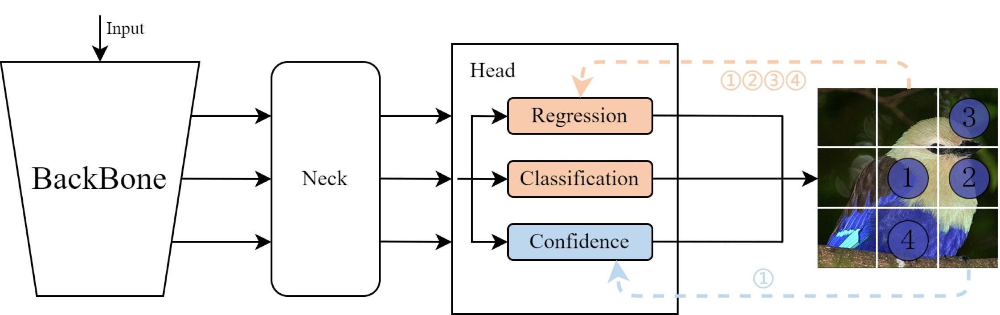

**Mixed label assignment realize end-to-end object detection**
========

## Introduction

Our code is based on [YOLOX](https://github.com/Megvii-BaseDetection/YOLOX), If you have more usage questions, please refer to the official YOLOX.

Mixed label assignment is an end-to-end training method, as shown below.




# Usage

## Data

Please download [VOC](http://host.robots.ox.ac. 383
uk/pascal/VOC/voc2012/index.html ) dataset and organize them as following:

```
VOCDIR/
  ├── VOC2012/
  	├── Annotations/
  	└── JPEGImages/
  	└── ImageSets/
  		├── Main
  			└── train.txt (11540)
  			└── val.txt (4952)
```

## Run

We use the standard __YOLOX-S__ as examples for training and evalulation.

### Eval our pretrianed models

```sh
# cd MA-YOLOX
python tools/eval.py ----exp_file exps/example/yolox_voc/yolox_voc_s.py \
  --batch-size 1 \
  --ckpt /path/to/you/checkpoint
  --conf 0.001 \
  --nms 0.65
```

You also can set nms=1.00 to display no NMS effect, or using NMS free post-processing

### Training your own models

Similarly, you can also train our model on a single process: 
```sh
python tools/train.py ----exp_file exps/example/yolox_voc/yolox_voc_s.py \
  --batch-size 16
```

# Model

|  Model   | mAP  | mAP(w/o NMS) | Weight   |
| :----: | :--: | :--: | :--: |
|  YOLOX   | 51.0 | 18.6         |  |
| MA-YOLOX | 52.6 | 52.7         | [ckpt(BaiDu)](https://pan.baidu.com/s/1hepNjAwV2eaH2K6ilgYOrw?pwd=defm) |

